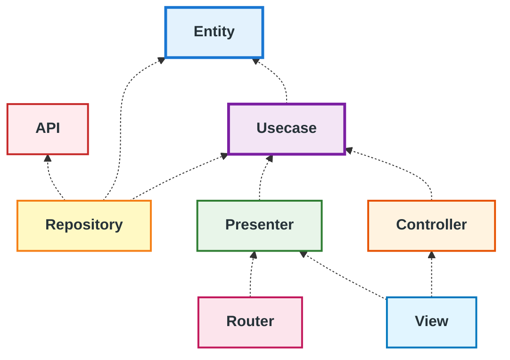

# 설계 

### 처리 흐름 다이어그램

```mermaid
graph LR
    subgraph "User Input/Output Flow"
        View1[View]
        Controller[Controller]
        Usecase1[Usecase]
        Presenter[Presenter]
        View2[View]
        
        View1 -->|Input| Controller
        Controller -->|Request| Usecase1
        Usecase1 -->|Response| Presenter
        Presenter -->|ViewModel| View2
    end
    
    subgraph "Data Flow"
        Usecase2[Usecase]
        Repository1[Repository]
        API[API]
        Repository2[Repository]
        Usecase3[Usecase]
        
        Usecase2 -->|Entity| Repository1
        Repository1 -->|Query| API
        API -->|DTO| Repository2
        Repository2 -->|Entity| Usecase3
    end
    
    style View1 fill:#e1f5ff,stroke-width:2px,color:#263238,font-weight:bold
    style View2 fill:#e1f5ff,stroke-width:2px,color:#263238,font-weight:bold
    style Controller fill:#fff3e0,stroke-width:2px,color:#263238,font-weight:bold
    style Usecase1 fill:#f3e5f5,stroke-width:2px,color:#263238,font-weight:bold
    style Usecase2 fill:#f3e5f5,stroke-width:2px,color:#263238,font-weight:bold
    style Usecase3 fill:#f3e5f5,stroke-width:2px,color:#263238,font-weight:bold
    style Presenter fill:#e8f5e9,stroke-width:2px,color:#263238,font-weight:bold
    style Repository1 fill:#fff9c4,stroke-width:2px,color:#263238,font-weight:bold
    style Repository2 fill:#fff9c4,stroke-width:2px,color:#263238,font-weight:bold
    style API fill:#ffebee,stroke-width:2px,color:#263238,font-weight:bold
```

### 모듈 의존성 다이어그램

```mermaid
graph BT
    Entity[Entity]
    API[API]
    Usecase[Usecase]
    Repository[Repository]
    Controller[Controller]
    Presenter[Presenter]
    View[View]
    Router[Router]
    
    %% Entity dependencies
    Usecase -.-> Entity
    Repository -.-> Entity
    
    %% Usecase dependencies
    Controller -.-> Usecase
    Presenter -.-> Usecase
    Repository -.-> Usecase
    
    %% Controller dependencies
    View -.-> Controller
    
    %% Presenter dependencies
    View -.-> Presenter
    Router -.-> Presenter
    
    %% API dependencies
    Repository -.-> API
    
    style Entity fill:#e3f2fd,stroke:#1976d2,stroke-width:3px,color:#263238,font-weight:bold
    style Usecase fill:#f3e5f5,stroke:#7b1fa2,stroke-width:3px,color:#263238,font-weight:bold
    style Repository fill:#fff9c4,stroke:#f57f17,stroke-width:2px,color:#263238,font-weight:bold
    style Controller fill:#fff3e0,stroke:#e65100,stroke-width:2px,color:#263238,font-weight:bold
    style Presenter fill:#e8f5e9,stroke:#2e7d32,stroke-width:2px,color:#263238,font-weight:bold
    style View fill:#e1f5ff,stroke:#0277bd,stroke-width:2px,color:#263238,font-weight:bold
    style Router fill:#fce4ec,stroke:#c2185b,stroke-width:2px,color:#263238,font-weight:bold
    style API fill:#ffebee,stroke:#c62828,stroke-width:2px,color:#263238,font-weight:bold
```

### 컴포넌트 의존성 다이어그램

```mermaid
graph BT
    subgraph UsecaseLayer["📦 Usecase Layer"]
        PUsecase["&lt;&lt;Protocol&gt;&gt;<br/>Usecase"]
        PUsecaseOutputPort["&lt;&lt;Protocol&gt;&gt;<br/>UsecaseOutputPort"]
        CUsecase["&lt;&lt;Class&gt;&gt;<br/>Usecase"]
        PRepository["&lt;&lt;Protocol&gt;&gt;<br/>Repository"]
    end
    
    subgraph PresenterLayer["📦 Presenter Layer"]
        PRouter["&lt;&lt;Protocol&gt;&gt;<br/>Router"]
        PRenderer["&lt;&lt;Protocol&gt;&gt;<br/>Renderer"]  
        CPresenter["&lt;&lt;Class&gt;&gt;<br/>Presenter"]
    end
    
    subgraph ControllerLayer["📦 Controller Layer"]
        CController["&lt;&lt;Class&gt;&gt;<br/>Controller"]
        PInputPort["&lt;&lt;Protocol&gt;&gt;<br/>InputPort"]
    end
    
    
    subgraph RouterLayer["📦 Router Layer"]
        CRouter["&lt;&lt;Class&gt;&gt;<br/>Router"]
    end
        
    subgraph ViewLayer["📦 View Layer"]
        CView["&lt;&lt;Class&gt;&gt;<br/>View"]
    end
        
    subgraph RepositoryLayer["📦 Repository Layer"]
        CRepository["&lt;&lt;Class&gt;&gt;<br/>Repository"]
    end
    
        %% Implementation relationships (Class implements Protocol)
    CUsecase ==>|implements| PUsecase
    CPresenter ==>|implements| PUsecaseOutputPort
    CRepository ==>|implements| PRepository
    CRouter ==>|implements| PRouter
    CController ==> |implements| PInputPort
    
    %% Dependency Injection relationships (Class depends on Protocol)
    CPresenter -.->|depends| PRenderer
    CPresenter -.->|depends| PRouter
    CView -.->|depends| PRenderer
    CView -.->|depends| PInputPort
    CUsecase -.->|depends| PUsecaseOutputPort
    CUsecase -.->|depends| PRepository
        CController -.-> |depends| PUsecase

            
    %% Protocol styles (dashed stroke for interface)
    style PUsecase fill:#f3e5f5,stroke:#7b1fa2,stroke-width:3px,stroke-dasharray: 5 5,color:#263238,font-weight:bold
    style PUsecaseOutputPort fill:#f3e5f5,stroke:#7b1fa2,stroke-width:3px,stroke-dasharray: 5 5,color:#263238,font-weight:bold
    style PRepository fill:#f3e5f5,stroke:#7b1fa2,stroke-width:3px,stroke-dasharray: 5 5,color:#263238,font-weight:bold
    style PRenderer fill:#e8f5e9,stroke:#2e7d32,stroke-width:3px,stroke-dasharray: 5 5,color:#263238,font-weight:bold
    style PRouter fill:#e8f5e9,stroke:#2e7d32,stroke-width:3px,stroke-dasharray: 5 5,color:#263238,font-weight:bold
    style PInputPort fill:#fff3e0,stroke:#e65100,stroke-width:3px,stroke-dasharray: 5 5,color:#263238,font-weight:bold
    
    %% Class styles (solid stroke for concrete class)
    style CUsecase fill:#f3e5f5,stroke:#7b1fa2,stroke-width:3px,color:#263238,font-weight:bold
    style CPresenter fill:#e8f5e9,stroke:#2e7d32,stroke-width:3px,color:#263238,font-weight:bold
    style CController fill:#fff3e0,stroke:#e65100,stroke-width:3px,color:#263238,font-weight:bold
    style CView fill:#e1f5ff,stroke:#0277bd,stroke-width:3px,color:#263238,font-weight:bold
    style CRouter fill:#fce4ec,stroke:#c2185b,stroke-width:3px,color:#263238,font-weight:bold
    style CRepository fill:#fff9c4,stroke:#f57f17,stroke-width:3px,color:#263238,font-weight:bold
```
